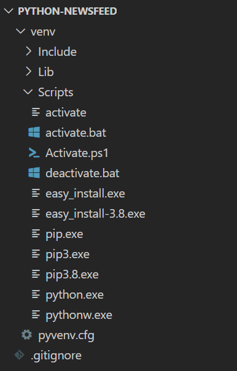
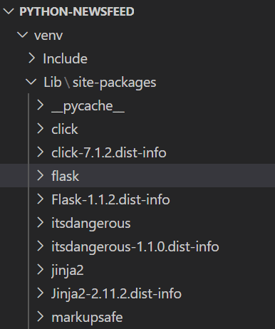

# Introduction-to-Flask-for-Python

## What is Flask?

### History

Flask was created by [Armin Ronacher](https://en.wikipedia.org/wiki/Armin_Ronacher). It is a web-framework that features a rich library to build web applications and APIs and is designed to be used with the Python programming language. It is the second most popular web-framework right behind Django and can be seen as the javascript equivalent to Express. Both Express and Flask provide tools to create C.R.U.D opperations for API's and provide tools to create and manage server logic.

Armin developed Flask along with group that he was a part of known as Pocoo. Pocoo was also responsible for the creation of Werkzeug and Jinja which are some of the components that make up flask.

### Components

**Werkzeug** is a [WSGI](https://wsgi.readthedocs.io/en/latest/what.html) web/utility library for Python that provides a set of tools for building web applications working with HTTP requests and responses and meet a set of standards for building web applications using python.

**Jinja** is known as a web template engine for Python it allows developers to create the structural layout of the page using HTML while also incorporating the application's logic that will handle the users interactions and data processing using python-themed syntax. This will make it easier to manage and maintain web application code. Jinja can be seen as the javascript equivalent of Handlebars.js in the same way that they both combine their respective coding language's syntax and logic with the structural code of HTML used to present the application.

### Installation

- First make sure you have python installed by typing `python --version` in the terminal. If you dont have it installed use this [link](https://www.python.org/downloads/).

- Once python is installed so will [Python Package Index (PyPI)](https://pypi.org/) which is a package manager for python just like npm is for javascript in the same way that that both are expansive libraries and help manage your dependancies (downloaded packages).

Before installing flask its important to understand best practices for using python libraries. By default, installing a Python library installs it globally meaning all future python projects will have the installed packages. However; Python provides a feature called a virtual environment—a self-contained directory that maintains its own version of Python and its own library dependencies. This way, multiple Python projects can reside on the same machine without interfering with each other.

To start the virtual environment run this script on the terminal `python -m venv venv` this will create a file named venv that will make the virtual environment possible. to start the virtual environment run `.\venv\Scripts\activate` if your using Windows or `. venv/bin/activate` for Mac. Once the virtual environment starts you can begin to download your dependencies. 
the folder will look something similar to this.



If you see `(venv) PS C:\Users\UserName\Desktop\projects\python-project>` in the terminal then you have started the virtual environment successfully. The (venv) signifies that you are now working in a virtual environment so always make sure its there before you begin working. Finally type `pip install flask` to install Flask. This will come with additional files like jinja2 that will allow you to start programming right away.

The folder will look something similar to this.



## how to work with Flask

### Set up

Once flask is installed you can begin coding. In the root directory (or main folder) of your project, create a new directory called app. In this directory, create a new file called `__init__.py`. That's two underscores on each side. 

**`__init__.py`** is an important file that's used in Python projects, and it is typically found in every directory, including the root directory of a Python package. It serves several key purposes. Firstly, it acts as an entry point to the directory in a similar way that one might use an index.js file in a JavaScript project to define the entry point for a module or package however when the `__init__.py` is in the root directory it can be seen as the server.js equivalent. Secondly, `__init__.py` is essential for Package Initialization. When a package is imported, the `__init__.py` file is executed. This allows you to perform any necessary package initialization tasks, such as setting up variables, importing modules, or defining package functions and classes. Anything you place in the `__init__.py` file is executed when the package is first imported. Here's a sample code example of `__init__.py` in the root directory to illustrate its usage as the root directory server file:

```
from flask import Flask
from app.routes import home, dashboard, api
from app.db import init_db
from app.utils import filters

def create_app(test_config=None):
  # set up app config
  app = Flask(__name__, static_url_path='/')
  app.url_map.strict_slashes = False
  app.config.from_mapping(
    SECRET_KEY='super_secret_key'
  )
  app.jinja_env.filters['format_url'] = filters.format_url
  app.jinja_env.filters['format_date'] = filters.format_date
  app.jinja_env.filters['format_plural'] = filters.format_plural
  
  @app.route('/hello')
  def hello():
   
   return 'hello world'
  
# register routes
  app.register_blueprint(home)
  app.register_blueprint(dashboard)
  app.register_blueprint(api)
  init_db(app)
  return app
```
#### Imports

As soon as `__init__.py` runs it starts to initialize and import the necessary modules and packages. the syntax is laid out using this template `from package_name import module_name`. so in the fist line `from flask import Flask` you are importing the module Flask from the package flask. Another example `from app.routes import home, dashboard, api` here your importing multiple local modules from the directory routes inside the app directory as noted by the `.`. 

####  Create_app()

The next step would be to have a function that starts the flask app. `create_app()` function could be named anything however it is good to follow best practices and give it a descriptive name. In our example the def create_app() function takes in an optional parameter `test_config=None` this helps configure the app so if the function is called without a parameter it will have a default value of none however if during testing, you can pass a configuration that points to a test database for testing.

 In the next line you have ` app = Flask(__name__, static_url_path='/')` This line creates a Flask application instance named app. The Flask(__name__, static_url_path='/') call initializes the Flask app with the name of the current module (__name__) and sets the static_url_path to '/'. The static_url_path is used to define the URL path where static files (e.g., CSS, JavaScript) are served from.

 

#### Configuration Settings

 In the next line you have ` app.url_map.strict_slashes = False` This line changes the strict_slashes attribute of the Flask app's url_map object. When strict_slashes is set to True, Flask will enforce strict URL trailing slashes meaning `/result/` and `/result` can lead to different views or resources. By setting it to False, you allow URLs with or without trailing slashes to be treated the same way so `/result/` and `/result` will lead to the same view within the application. Whether it set to true or false is up to preference or depending on the requirements for the application. 

Lets break down the next line `app.config.from_mapping( SECRET_KEY='super_secret_key')`. The `app.config` object that allows you to store various configuration settings. These settings can affect how your application behaves, and they are often used to store sensitive information, such as API keys or database credentials. the method `from_mapping()` sets configuration values in your Flask application. It takes an object and updates the configuration settings with the key-value pairs provided in that object. inside from_mapping() method there is an argument `SECRET_KEY='super_secret_key'`. SECRET_KEY is a configuration variable and is used to provide a secret key that is crucial for security-related tasks, such as session management and generating secure tokens. The value in this example is `'super_secret_key'` which serves as a secret token that enhances the security of your application, particularly for session management.

#### Registering Jinja Filters

After the configuration in the create_app function we have three lines that are all similar and follow this template `app.jinja_env.filters['filter name'] = file where the filter is located.function name` what this is doing is calling app which is an instance of flask and then calling jinja_env.filters dictionary (which is a type of class in python) the [''] is the name of the custom filter your adding. The functionality for the custom filter is given here `= file where the filter is located.function name`  this part tells Flask where to find that function. In summary the purpose of these lines is to enhance the functionality of Jinja2 templates within the Flask application. By adding custom filters, you're extending the capabilities of Jinja2, making it easier to format and manipulate data within your templates.

#### Route Definitions

This defines a simple route /hello that responds with "hello world" when accessed. The @app.route() decorator associates the function hello() with the URL path /hello.

#### Registering Blueprints

These lines register Flask blueprints with the application. Blueprints are a way to organize and modularize routes and views in a Flask application.

#### Database Initialization

This line initializes the database by calling the init_db() function with the Flask app instance as an argument.

#### Returning the Flask Application

Finally, the create_app function returns the configured Flask application, making it ready for running with a web server.


 

